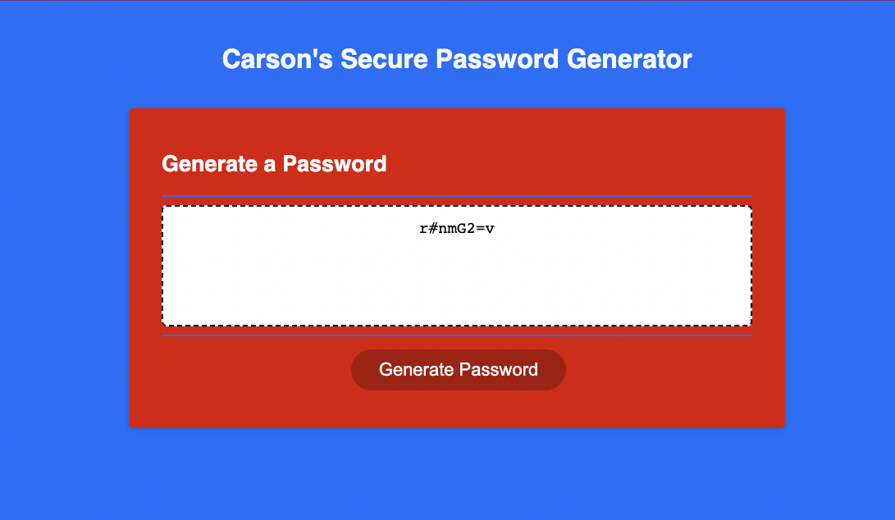

# Carson James Password Generator

## Description
---
- In this challenge, we were given the HTML, CSS, and JS files as our starter code. Using this starter code we were asked to create working logic and functions to develop a password generator with said code. The motivation for this project was to make sure that the webapp gives the user what they want and usablity to customize their random password however they please. The reason I built this project was to learn more about javascript and the applications it has within websites. It also helped me understand the power javascript has and how it can be used to allow a website to function. The problem at hand was solved by using variables of uppercase letters, lowercase letters, numbers, and special characters in arrays as possible outcomes for the password. Along with that, creating several if/else statements and functions to make the possibilities come to life and produce a working password generator. 

## Installation
---
- To get the project up and running I changed the styling of the HTML to give it a more welcoming feel. After that, I went in the .js file to give the html logic and functions. Once I was happy with the results after running a few tests with different options and outcomes, I pushed everything to github. Once all of my work was in the github repository, I migrated to the pages section, and pushed the repository live. 

## Usage
---

1. GitHub Deployment: https://carsonjames1125.github.io/Carson-James-Password-Generator/

## Credits
---

List your collaborators, if any, with links to their GitHub profiles.

If you used any third-party assets that require attribution, list the creators with links to their primary web presence in this section.

If you followed tutorials, include links to those here as well.

## License
---

- MIT License

---

Copyright (c) 2023 carsonjames1125

Permission is hereby granted, free of charge, to any person obtaining a copy
of this software and associated documentation files (the "Software"), to deal
in the Software without restriction, including without limitation the rights
to use, copy, modify, merge, publish, distribute, sublicense, and/or sell
copies of the Software, and to permit persons to whom the Software is
furnished to do so, subject to the following conditions:

The above copyright notice and this permission notice shall be included in all
copies or substantial portions of the Software.

THE SOFTWARE IS PROVIDED "AS IS", WITHOUT WARRANTY OF ANY KIND, EXPRESS OR
IMPLIED, INCLUDING BUT NOT LIMITED TO THE WARRANTIES OF MERCHANTABILITY,
FITNESS FOR A PARTICULAR PURPOSE AND NONINFRINGEMENT. IN NO EVENT SHALL THE
AUTHORS OR COPYRIGHT HOLDERS BE LIABLE FOR ANY CLAIM, DAMAGES OR OTHER
LIABILITY, WHETHER IN AN ACTION OF CONTRACT, TORT OR OTHERWISE, ARISING FROM,
OUT OF OR IN CONNECTION WITH THE SOFTWARE OR THE USE OR OTHER DEALINGS IN THE
SOFTWARE.

---

## Badges

n/a

## Features

n/a

## How to Contribute

n/a

## Tests

n/a